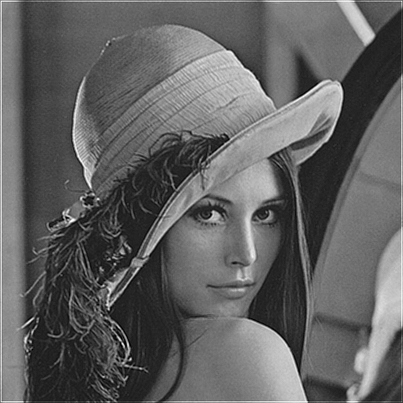

# FPGA-Based Image Processing Pipeline Simulator


## Overview
This project is a **C++ hardware accelerator model** designed to simulate a synchronous 4-stage FPGA image processing pipeline. It bridges the gap between high-level algorithmic development and low-level RTL implementation by enforcing hardware constraints such as fixed-point arithmetic, memory bandwidth limitations, and pipeline latency.

Developed as part of the **Xcelerium IC Design Training** at **NED University of Engineering & Technology**.

---

## System Architecture
The simulator models a **Synchronous 4-Stage Pipeline**. To prevent race conditions and accurately mimic hardware latches, the pipeline executes in **Reverse Order (Stage 4 $\to$ Stage 1)** within each clock cycle.

### Pipeline Stages
| Stage | Module | Description |
| :--- | :--- | :--- |
| **1** | **Frame Reader** | Simulates the physical layer reading raw data from host memory into input registers. |
| **2** | **ISP Block** | Performs Color Conversion (RGB $\to$ Grayscale) using fixed-point math. |
| **3** | **DSP Engine** | The core convolution engine. Implements **Gaussian**, **Sharpen**, and **Sobel** filters using a 3x3 MAC structure. |
| **4** | **Frame Writer** | DMA-like write back to memory. |

### Data Flow

*See `docs/report.pdf` for the detailed report.*

---

## Key Features

### 1. Hardware-Accurate Memory Model
* **Ping-Pong Buffering:** Implements double-buffering for the DSP engine to ensure safe read/write operations during convolution, mirroring FPGA block RAM usage.
* **Template-Based Bus Width:** Uses C++ templates (`FrameBuffer<T>`) to simulate variable bus widths (e.g., 24-bit RGB vs. 8-bit Grayscale).

### 2. Floating and Fixed-Point Arithmetic
The system uses both floating-point and fixed-point math. To simulate DSP slices on an FPGA, we default to fixed arithmetic. It uses integer coefficients scaled by 256 ($2^8$) and replaces division with bit-shifting.

**Example: RGB to Grayscale Formula**
```cpp
// Floating Point
Y = 0.299*R + 0.587*G + 0.114*B;

// Fixed Point
Y = (77*R + 150*G + 29*B) >> 8;

```

### 3. Reconfigurable Filter Kernels

The DSP engine supports runtime reconfiguration of filter weights, simulating a programmable register map :

* **Box Blur:** Hardware noise-floor reduction (Always On).


*  **Gaussian / Sharpen:** Time-multiplexed on the same MAC units.


* **Sobel:** Dedicated edge-detection logic block.


---

## Build & Run

### Prerequisites

* Linux (Ubuntu 20.04/24.04 recommended) 


* `g++` compiler
* `make`

### Compiling

The project includes a Makefile with multiple build targets :

```bash
# Standard Build (Fixed-Point)
make

# Debug Mode
make debug

# Floating-Point Mode
make float

# Clean Build
make clean

```

### Running the Simulator

Usage: `./ha [options] <input_image> <input_image_2> ...`

```bash
# Run with Gaussian Blur and Sobel Edge Detection
./ha -gaussian -sobel assets/lena.bmp

# Run with Sharpening
./ha -sharpen assets/blackbuck.bmp

```

---

## Results

Below is a comparison of the input vs. processed output.

| Input | Sharpen Output | Sobel Output |
| --- | --- | --- |
|  |  |  |

---

## License

This project is open-source and available under the [MIT License](LICENSE).

**Author:** Adil Rafiq

```

```
